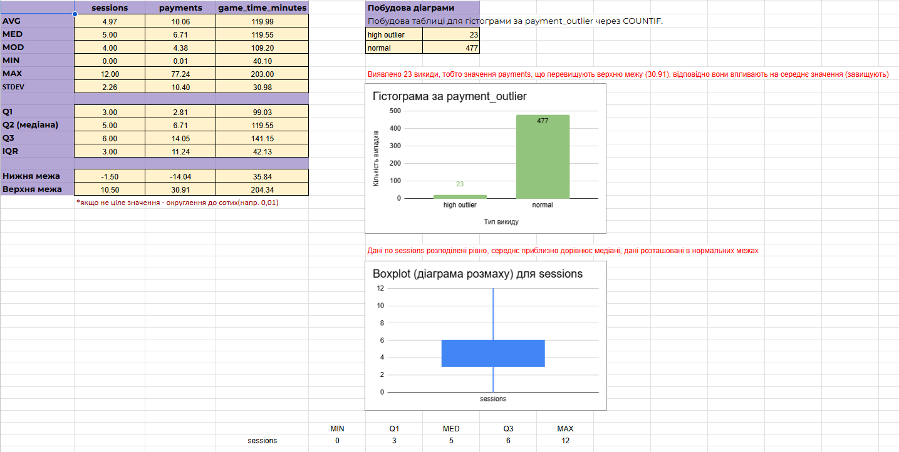

# Statistical Analysis & Outlier Detection (Google Sheets)

## Project Overview
This project focuses on descriptive statistics and identifying data anomalies within a user behavior dataset. The goal was to clean raw data, calculate statistical metrics, and visualize distributions to provide business insights.

## Key Technical Tasks:
* **Descriptive Statistics:** Calculated Mean, Median, Mode, Standard Deviation, and Quartiles (Q1, Q2, Q3) for key metrics like payments and sessions.
* **Outlier Detection:** Used the Interquartile Range (IQR) method to define upper and lower bounds for anomalies.
* **Data Transformation:** Created a dynamic classification system using the `IF` function to label data points as "normal," "low outlier," or "high outlier."
* **Advanced Visualization:** * Constructed a **Histogram** to show payment distribution by category.
    * Built a **Boxplot (Candlestick chart)** for session analysis to visualize the spread and potential outliers.

## Key Insights (from the 'Explanation' sheet):
* Identified how outliers impact the Mean vs. Median.
* Analyzed the business implications of extreme user behavior (high-paying users vs. the majority).
* Evaluated how reporting accuracy changes when outliers are included or excluded.

## Visualizations

---
*Tools used: Google Sheets (USA locale), IQR Statistical Method.*
