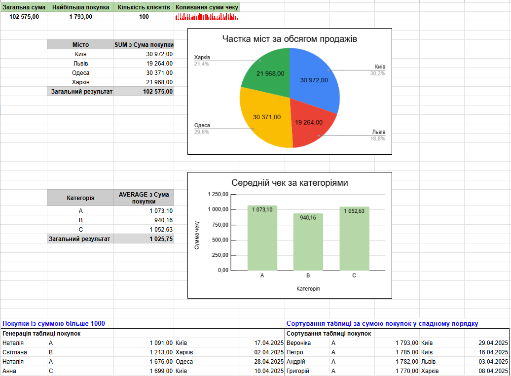

# Google Sheets Analytical Dashboard

## Project Overview
This project involves transforming raw data (100+ transactions) into a functional analytical dashboard. It demonstrates end-to-end data processing: from cleaning to visual storytelling.

## Key Features & Skills:
* **Data Transformation:** Applied logical functions (`IF`), date formatting, and numerical rounding.
* **Advanced Formulas:** Utilized `FILTER()` and `SORT()` to create dynamic data views.
* **Data Aggregation:** Created Pivot Tables and calculated key business metrics (Total Revenue, Customer Count, Max Purchase).
* **Data Visualization:** Developed a minimalist dashboard featuring Bar charts, Pie charts, and `SPARKLINE` indicators for trend analysis.

## Dashboard Preview

---
*Note: This project was completed as part of the GoIT Data Analysis course.*
