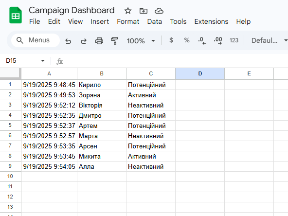

# CRM Data Integration & Workflow Automation

## Project Overview
This project demonstrates the creation of an automated tracking system that syncs data between different spreadsheets and logs historical changes. It showcases the transition from manual data entry to automated workflows using Google Apps Script.

## Technical Implementation:
* **Data Integration:** Implemented `IMPORTRANGE` to establish a live connection with an external CRM Database, ensuring data synchronization across different files.
* **Lookup & Reference:** Used `VLOOKUP` for dynamic data retrieval and `MATCH` to pinpoint exact data positions within the CRM structure.
* **Automation (Google Apps Script):** Developed a custom `onEdit(e)` trigger script to monitor status changes.
* **Change Management:** Built an automated `notes_log` system that records:
    * Timestamp of the edit.
    * Client Name.
    * Updated Status.

## Why this matters:
Instead of manually checking for updates, this system provides a "Live Dashboard." Any change in the source CRM is instantly reflected in the tracker and documented in the history log, preventing data loss and improving operational efficiency.

🔗 **Live Version:** [Google Sheets Link](https://docs.google.com/spreadsheets/d/1-R6uDo4D2pJbLvMD7T62n6Y9vUm1nTJRHAkYevqWZog/edit?usp=sharing)

## Code Preview (Google Apps Script)
*The full script can be found in the `script.gs` file in this repository.*

## Results

---
*Tools: Google Sheets, Google Apps Script (JavaScript-based), IMPORTRANGE, VLOOKUP/MATCH.*
Note: This project was completed as part of the GoIT Data Analysis course.
