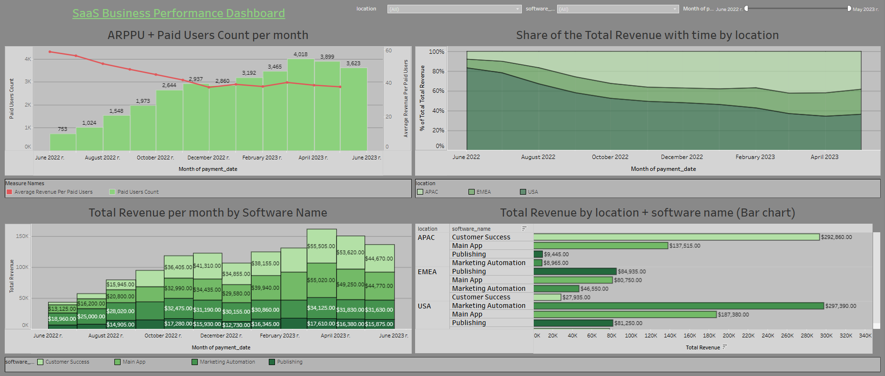

# Revenue Performance Dashboard in Tableau

## Project Overview
This project focuses on building an interactive business dashboard using Tableau Public to analyze company revenue streams. The analysis covers temporal trends, product performance, and geographical distribution of income.

## Key Visualizations & Metrics:
* **Revenue Dynamics:** Monthly total revenue trends with breakdown by location and product.
* **Geographical Analysis:** Comparison of revenue across different markets and product combinations.
* **Calculated Metrics (LOD & Measures):** * `Total Revenue`
    * `Paid Users Count`
    * `ARPPU` (Average Revenue Per Paid User)
* **Interactive Dashboard:** A consolidated view with 4-6 worksheets, synchronized through global filters (Location, Product, Date).

## Technical Skills Applied:
* **Data Modeling:** Connecting and structuring datasets for BI analysis.
* **Calculated Fields:** Implementing business formulas within Tableau.
* **Dashboard Design:** Applying UI/UX principles for data clarity and interactivity.
* **Advanced Visuals:** Implementation of Box Plots for transaction distribution and Percentage of Total charts.

🔗 **Live Dashboard:** [Link to your Tableau Public Profile](https://public.tableau.com/views/GoIT_HW_Tableau1/SaaSBusinessPerformanceDashboard?:language=en-US&:sid=&:redirect=auth&:display_count=n&:origin=viz_share_link)

## Dashboard Preview

Note: This project was completed as part of the GoIT Data Analysis course.
