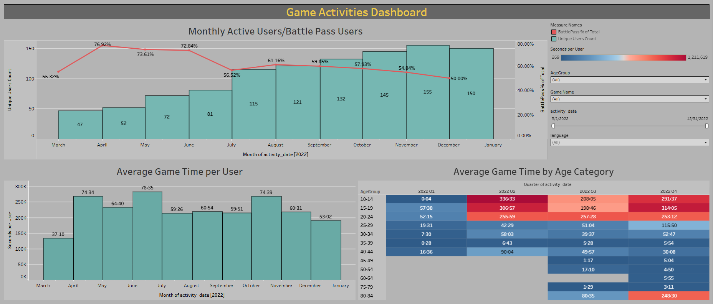

# Mobile Game User Activity Dashboard

## Project Overview
This project analyzes user engagement metrics for a mobile game. It focuses on activity distribution across demographics, time spent in-game, and Battle Pass adoption rates.

## Key Features & Visualizations:
* **Engagement Funnel:** Tracking unique users and the percentage of "Battle Pass" participants.
* **Time Management Analytics:** Created custom calculated fields to convert raw seconds/minutes into a readable "HH:MM" format for average session duration.
* **Activity Heatmap:** Cross-segment analysis of game time by 5-year age groups and quarterly seasonality.
* **Interactive Filtering:** Comprehensive dashboard filters including Device Language, Game Name, Age Group, and Date.

🔗 **Tableau Public Workbook:** [Games Activities Dashboard](https://public.tableau.com/views/GameActivitiesDashboardHW2/GameActivitiesDashboard?:language=en-US&:sid=&:redirect=auth&:display_count=n&:origin=viz_share_link)

## Dashboard Preview

Note: This project was completed as part of the GoIT Data Analysis course.
