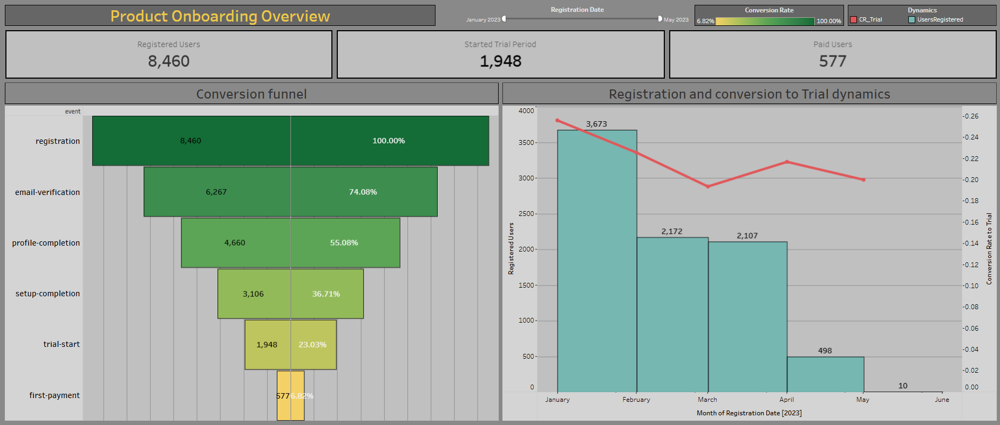

# User Conversion Funnel Dashboard

## Project Overview
This project visualizes the user journey from initial registration to the first payment. The goal is to identify conversion bottlenecks and track the effectiveness of the trial period in converting users into paying customers.

## Key Visualizations & Analytics:
* **KPI Scorecards:** High-level metrics for Registered Users, Trial Starters, and Paid Customers with embedded conversion rates in tooltips.
* **Registration Dynamics:** A dual-axis chart showing the monthly volume of registrations alongside the "Registration-to-Trial" conversion rate.
* **Conversion Funnel:** A classic funnel visualization showcasing the absolute number of users at each stage and the relative drop-off rates.
* **Time-Independent Conversion:** Implemented logic to track conversions based on the registration cohort, regardless of when the subsequent action (trial/payment) occurred.

## Technical Implementation:
* **LOD Expressions:** Used to calculate cohort-based conversion rates.
* **Funnel Visualization:** Applied sorting and step-chart techniques to create a clean funnel aesthetic.
* **Interactive Tooltips:** Custom tooltips designed to provide context on conversion performance without cluttering the main dashboard.

🔗 **Live Dashboard:** [Onboarding Funnel Product](https://public.tableau.com/views/OnboardingFunnelProduct_17702271575090/ProductOnboardingOverview?:language=en-US&publish=yes&:sid=&:redirect=auth&:display_count=n&:origin=viz_share_link)

## Dashboard Preview

Note: This project was completed as part of the GoIT Data Analysis course.
