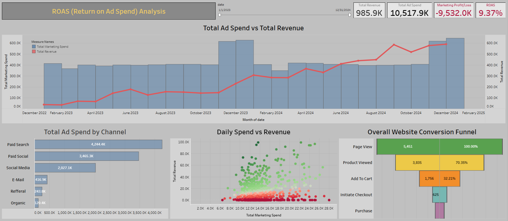

# Marketing Efficiency & ROI Dashboard

## 📌 Project Overview
This project involves a comprehensive audit of a $10.5M marketing budget for an e-commerce platform. The primary objective was to evaluate the true Return on Ad Spend (ROAS) across various acquisition channels, identify bottlenecks in the user journey, and uncover actionable insights for budget optimization. 

*Disclaimer: This dashboard is built using a synthetic dataset. As part of the analytical process, several anomalies typical of generated data (such as uniform CPC across all channels) were successfully identified and accounted for in the visual strategy.*

## 🛠 Tools & Techniques
* **Tool:** Tableau Desktop / Tableau Public
* **Techniques:** * Data Modeling & Relationships
  * Level of Detail (LOD) Expressions
  * Advanced Calculated Fields (Net Revenue, ROAS, CPA)
  * Outlier Detection & Interactive Dashboards

## 🧠 Analytical Approach & Data Rigor
Instead of taking the raw data at face value, this project demonstrates a deep dive into data integrity and business logic:
* **Net Revenue vs. Gross Revenue:** Adjusted the default `Total Amount` by subtracting `Discount Amount` and filtering for `completed` order statuses to calculate actual realized revenue, preventing ROAS inflation.
* **Navigating Attribution Limits & Synthetic Data:** Identified a many-to-many relationship (Date Bridge) between Marketing Spend and Transactions. Recognizing the synthetic nature of the uniform metrics, I adjusted the analytical strategy to focus on overarching spend efficiency and volume allocation rather than forcing inaccurate direct channel attribution.
* **Custom Funnel Logic:** Implemented LOD expressions to build a multi-step user conversion funnel (Page Views -> Cart -> Checkout -> Purchase), calculating exact drop-off rates at each stage.

## 📊 Dashboard Architecture
The dashboard is structured for immediate executive consumption (T-shaped layout):
1. **Executive BANs (Big Numbers):** High-level snapshot of Total Revenue, Total Ad Spend, and overall ROAS.
2. **Dual-Axis Trend Analysis:** Visualizes the daily flow of Spend vs. Net Revenue, highlighting seasonal spikes and periods of heavy budget burn.
3. **Spend Allocation (Bar Chart):** Ranks acquisition channels by total budget consumed (Paid Search, Paid Social, etc.).
4. **Daily Spend vs. Revenue (Scatter Plot):** Analyzes the correlation between daily marketing investments and daily returns, featuring a dynamic break-even reference line.
5. **Conversion Funnel:** Tracks user retention across the purchasing journey.

## 💡 Key Insights & Findings
1. **Critical ROAS Level:** The overarching ROAS sits at an unsustainable **0.09 (9%)**, indicating that the current customer acquisition strategy is highly unprofitable.
2. **Budget Misallocation:** Over 70% of the budget is concentrated in Paid Search ($4.2M) and Paid Social ($3.4M), yet the return does not scale with the spend. 
3. **The $99k Outlier:** The scatter plot revealed a significant anomaly—a single peak day generated $99,000 (roughly 10% of the entire historical revenue). This indicates strong product-market fit on specific campaign days, but highlights the failure to maintain or scale that success efficiently.

## 🚀 How to View
You can interact with the live dashboard on Tableau Public:
[**View the Interactive Dashboard Here**](https://public.tableau.com/views/E-CommerceMarketingPerformance/ROASReturnonAdSpendAnalysis?:language=en-US&:sid=&:redirect=auth&:display_count=n&:origin=viz_share_link)

---
*Screenshot of the dashboard:*

---
*Note: This project was completed as part of the GoIT Data Analysis course.*
