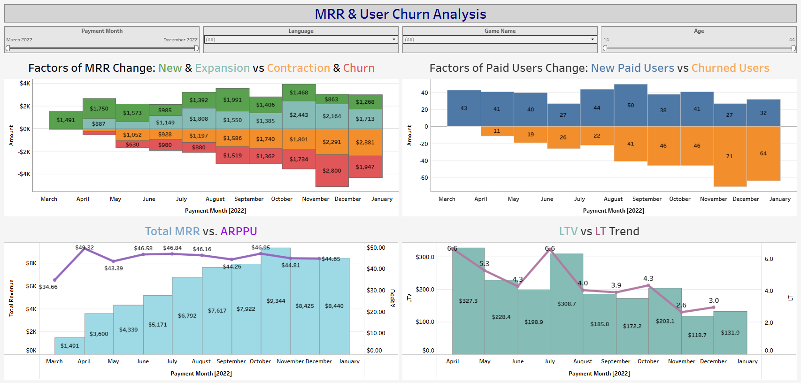
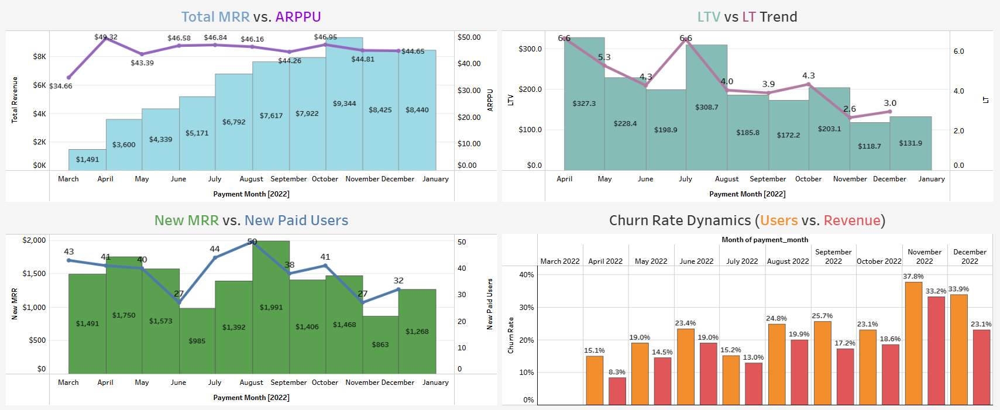

# SaaS Revenue & Unit Economics Dashboard (Final Project)

## Project Overview
This is the final capstone project of the Data Analysis course. The objective was to build a comprehensive executive dashboard for a subscription-based product (SaaS) to monitor revenue dynamics and analyze growth/churn factors.

## Key Business Metrics Implemented:
* **Growth:** Monthly Recurring Revenue (MRR), Expansion MRR, New MRR.
* **Efficiency:** ARPPU (Average Revenue Per Paid User), LTV (Lifetime Value).
* **Retention:** Churn Rate (User & Revenue), Churned Revenue, Customer Lifetime (LT).
* **Volume:** Paid Users, New Paid Users, Contraction MRR.

## Technical Stack:
* **SQL (PostgreSQL):** Developed a complex multi-stage query using Window Functions and CTEs to transform raw transaction logs into a monthly analytical dataset.
* **Tableau Public:** Designed an interactive dashboard following the "5-second rule" and F-pattern layout.
* **Unit Economics:** Applied industry-standard formulas to calculate long-term user value and attrition.

## Dashboard Features:
* **Executive Summary:** High-level KPI cards for immediate performance health check.
* **Factor Analysis (Bridge Charts):** Detailed visualization of what drives MRR changes (New vs. Expansion vs. Churn).
* **User Lifecycle:** Breakdown of user transitions between statuses (New, Active, Churned).
* **Interactive Filters:** Global filters by Date, User Language, and Age Group.

🔗 **Live Dashboard:** [Link to your Tableau Public Project](https://public.tableau.com/views/Final_Project_dashboard/MRRUserChurnAnalysis?:language=en-US&:sid=&:redirect=auth&:display_count=n&:origin=viz_share_link)

## Dashboard Preview

Note: 
Data was sourced from a PostgreSQL database (schema "project").

This project was completed as part of the GoIT Data Analysis course.
